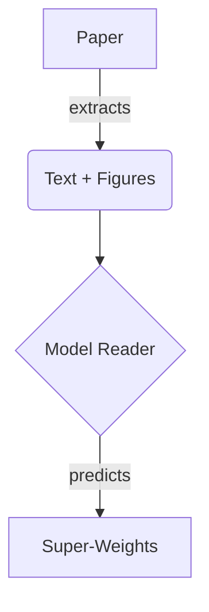

# Features

- Easier setup and quickstart
- Built-in CLI and Python API
- Works with arXiv links and local PDFs
- Configurable output formats
- Extensible pipeline

## Diagrams

## Tasks

- [x] GitHub Pages deployment
- [x] Material theme enhancements
- [ ] Dataset examples